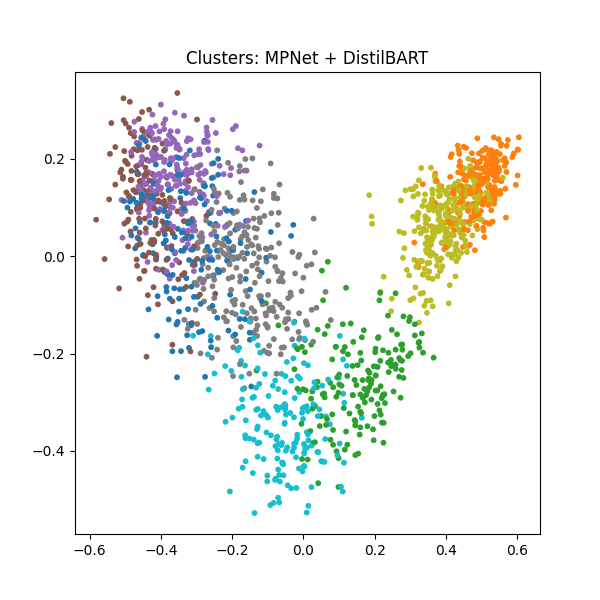

# Literary Cluster Exploration with NLP
This repository contains code to explore how unsupervised NLP methods can reveal **latent structures in literature**.  
We take text from three classic novels:

- *Pride and Prejudice* by Jane Austen  
- *Moby-Dick* by Herman Melville  
- *Frankenstein* by Mary Shelley  

The text is split into chunks, embedded using sentence-level models, clustered with **K-Means**, and summarized with lightweight **abstractive summarizers**.  
The results show that the pipeline can automatically distinguish **authors, themes, and narrative styles** without any supervision.

---
## How to Run
1. Clone the repo:
   ```bash
   git clone https://github.com/sarahackerschewski/literary-clusters.git
   cd literary-clusters
2. Open the notebook:
   ```bash
   jupyter notebook notebooks/literary_clustering.ipynb
3. Run all cells.

The notebook will generate embeddings, cluster assignments, summaries, and visualizations for all four model combinations.
Results are saved automatically in the results/ folder.

---
## Experiments
We run six combinations:

| Experiment | Embedding Model | Summarizer Model |
|------------|----------------|------------------|
| 1 | MiniLM | DistilBART |
| 2 | MPNet  | DistilBART |
| 3 | MiniLM | T5 |
| 4 | MPNet  | T5 |
| 5 | MiniLM | BART |
| 6 | MPNet  | BART |

Each run outputs:
- `results_MODEL_SUMMARIZER.csv` → Cluster assignments for each text chunk  
- `summaries_MODEL_SUMMARIZER.txt` → Human-readable cluster summaries  
- `clusters_MODEL_SUMMARIZER.png` → Visualization of cluster separation

---

## Repository Structure
```
│── literary_clusters.ipynb # Main notebook with all steps
│── data/
│ └── novels/ # Gutenberg texts
│ └──results/
│    ├── results_MiniLM_BART.csv
│    ├── results_MPNet_BART.csv
│    ├── ...
│    ├── summaries_MiniLM_BART.txt
│    └── clusters_MiniLM_BART.png
│── README.md
```

---

## Background
Text summarization is an essential task in Natural Language Processing (NLP) with the goal of preserving important information, while condensing the input as much as possble, which is crucial in various domains, where efficiently processing large volumes of text is essential.

### Models
**BART (Bidirectional and Auto-Regressive Transformers)**
BART is a sequence-to-sequence model pre-trained as a denoising autoencoder. It combines the bidirectional encoder of BERT and the autoregressive decoder of GPT, making it effective for tasks like abstractive summarization. 

**DistilBART**
DistilBART is a distilled version of BART, trained on the CNN/Daily Mail summarization dataset. It is smaller and faster than BART, while maintaining strong performance for tasks like summarization.

**T5-small (Text-to-Text Transfer Transformer)**
T5-small is a text-to-text framework, which among other tasks also specializes for summarization.

**MPNet (Masked and Permuted Pre-training for Language Understanding)**
MPNet is a sentence transformer model for embedding text in a 768 dimensional dense vector space. Its performance is slower than other embedding models (e.g. MiniLM) due to its bigger size but overall better average performance in various tasks

**MiniLM (Deep Self-Attention Distillation for Task-Agnostic Compression of Pre-Trained Transformers)**
MiniLM is a sentence transformer model which maps texts to a 384 dimensional dense vector space. It is faster than MPNet, but is said to have slightly worse performance

### Project Scope and Model Selection

This portfolio project investigates how well transformer-based models perform in a text summarization task without the need for high computational resources. The transformer & embedding models, i.e. BART, DistilBART, T5, MPNet, and MiniLM, seem to offer a balance between performance and computational efficiency, making them suitable for local execution on machines without GPUs

## Methods
1. **Text Processing**  
   - Download texts from [Project Gutenberg](https://www.gutenberg.org/).  
   - Clean and split into manageable chunks.  

2. **Embeddings**  
   - SentenceTransformer models chosen:  
     - `all-MiniLM-L6-v2` 
     - `all-mpnet-base-v2`  

3. **Clustering**  
   - K-Means with adjustable cluster count (default: 8).  
   - Dimensionality reduction for visualization with PCA.  

4. **Summarization**  
   - Hugging Face `transformers` pipelines:  
     - `sshleifer/distilbart-cnn-12-6` (DistilBART)  
     - `t5-small` (T5 small)
     - `facebook/bart-large-cnn` (BART)

5. **Evaluation**  
   - Compare how clusters differ with different embedding/summarizer combos.  
   - Save results as `.csv`, `.txt` summaries, and `.png` cluster visualizations.

---

## Evaluation

- **MiniLM + BART**:  
  Clusters were fairly coherent but sometimes mixed content from different novels. For example, Cluster 0 focused on _Pride and Prejudice_’s domestic scenes, while Cluster 1 captured the fantastical and supernatural elements of _Moby-Dick_. Summaries were readable but occasionally contained some repetition.  

- **MPNet + BART**:  
  Produced more distinct clusters. Each cluster captured a clearer thematic or narrative focus: domestic life in Austen’s works, whale hunting scenes in Melville, or tragic events in _Frankenstein_. Summaries were more structured and captured the key events and actions within each cluster.  

- **MiniLM + T5**:  
  Summaries were shorter and often more repetitive, sometimes including filler text or repeated phrases, as well as a lot of `,`, probably a result of a lot of noise. Clusters were interpretable but occasionally less coherent.  

- **MPNet + T5**:  
  Summaries captured dramatic and narrative elements (e.g., whaling scenes, Gothic suspense) but often repeated content within clusters. Cluster distinctions were clear, but the model tended generate redundant sequences and like the _MiniLM + T5_ combo a lot of `,`

- **MPNet + DistilBART** produced the most balanced and interpretable clusters. Each cluster captured a distinct theme, ranging from whale hunting scenes and seafaring life to domestic interactions in *Pride and Prejudice* and the tragic events in *Frankenstein*. Summaries were concise and cohesive.  

- **MiniLM + DistilBART** also captured all three novels but showed more overlap between clusters. Some summaries were verbose or repeated content, with a heavier emphasis on *Moby-Dick* scenes.  
  

Overall, MPNet embeddings consistently outperformed MiniLM embeddings. Regarding the summarizers, T5 performed worst of all, while BART and DistilBART performed similarly well. The resulting clusters and summaries, especially of MPNet & BART/DistilBART highlight recurring themes, character interactions and narrative patterns within each book and were able to differentiate between the books as well, e.g. distinctions between _Pride and Prejudice_’s social dialogues, _Moby-Dick_’s whaling expeditions and _Frankenstein_’s gothic suspense. This provides insight into the underlying structure of the novel.
However, some summaries are repetitive, incomplete, or stylistically inconsistent and show that there is still potential for improvement.

## Future work
- experimenting with larger or fine-tuned language models
- improving chunking strategies
- integrating semantic similarity measures, e.g. for filtering duplicate chunks and reducing noise, which would yield better summaries


## Sources
- Liu, Y., & Lapata, M. (2019). Text summarization with pretrained encoders. arXiv preprint arXiv:1908.08345.
- Zhang, H., Yu, P. S., & Zhang, J. (2025). A systematic survey of text summarization: From statistical methods to large language models. ACM Computing Surveys, 57(11), 1-41.
- Wibawa, A. P., & Kurniawan, F. (2024). A survey of text summarization: Techniques, evaluation and challenges. Natural Language Processing Journal, 7, 100070.
- https://machinelearningmastery.com/text-summarization-with-distillbart-model/
- https://huggingface.co/docs/transformers/model_doc/bart
- https://huggingface.co/sshleifer/distilbart-cnn-12-6
- https://huggingface.co/google-t5/t5-small
- https://www.sbert.net/docs/sentence_transformer/pretrained_models.html
- https://huggingface.co/sentence-transformers/all-MiniLM-L6-v2
- https://huggingface.co/sentence-transformers/all-mpnet-base-v2
